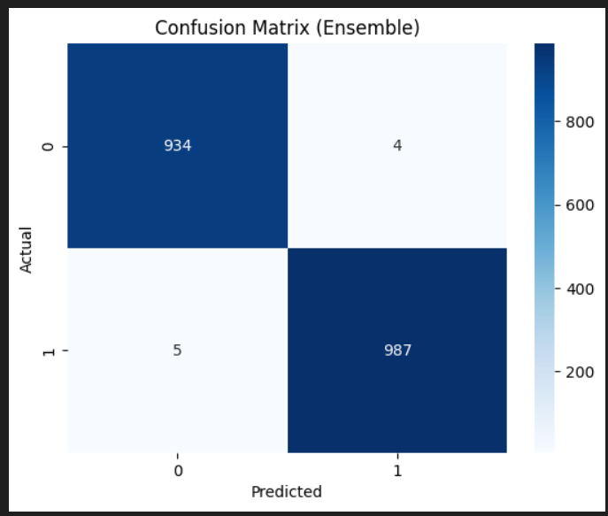
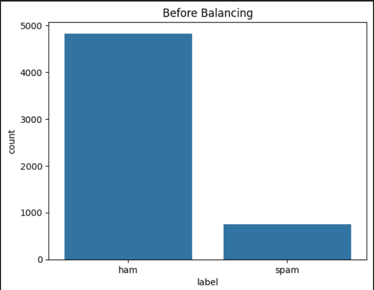
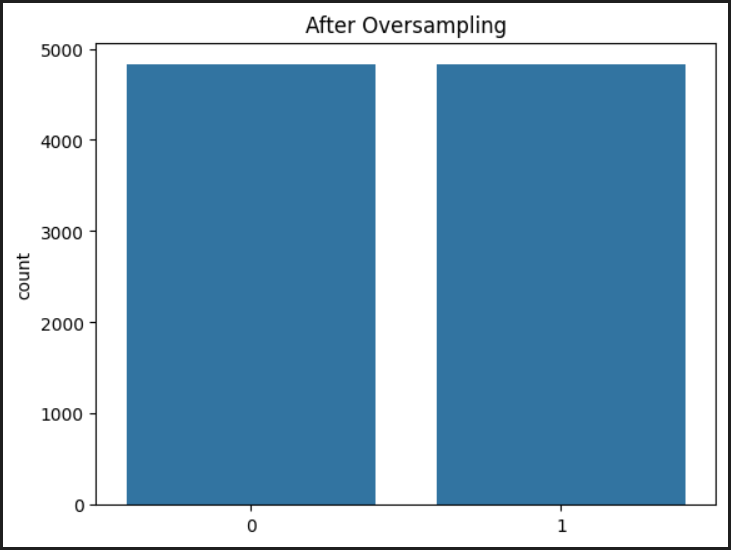

# 📧 AI-Powered Spam Email Detection System

🚀 This project is an end-to-end Machine Learning and NLP-based system that classifies messages as **Spam ❌** or **Not Spam ✅**.

---

## 🧠 Problem Statement
Spam messages are a major issue in communication systems.  
The goal of this project is to build a model that can accurately detect spam messages using Natural Language Processing.

---

## ⚙️ Tech Stack
- Python 🐍
- Scikit-learn
- NLP (NLTK)
- TF-IDF Vectorization
- Ensemble Learning
- Matplotlib & Seaborn

---

## 🔍 Features
✔ Advanced text preprocessing (lowercasing, URL removal, punctuation removal)  
✔ Tokenization & Lemmatization  
✔ Stopword removal  
✔ Feature extraction using **TF-IDF + N-grams**  
✔ Handled imbalanced dataset using **Oversampling**  
✔ Built an **Ensemble Model** (Logistic Regression + Random Forest + Naive Bayes)  
✔ Evaluated using accuracy, confusion matrix, precision & recall  

---

## 📊 Model Performance
- ✅ Accuracy: **~99%**
- ✅ High Recall for Spam Detection
- ✅ Minimal False Negatives
- ✅ No Overfitting (Train ≈ Test Accuracy)

---

## 📸 Results

### 🔹 Confusion Matrix



---

### 🔹 Data Distribution (Before & After Balancing)





## 🧪 Example Prediction

```python
Input: "Congratulations! You won ₹5000"
Output: 🚫 Spam

Input: "Hey bro kal class hai kya"
Output: ✅ Not Spam
